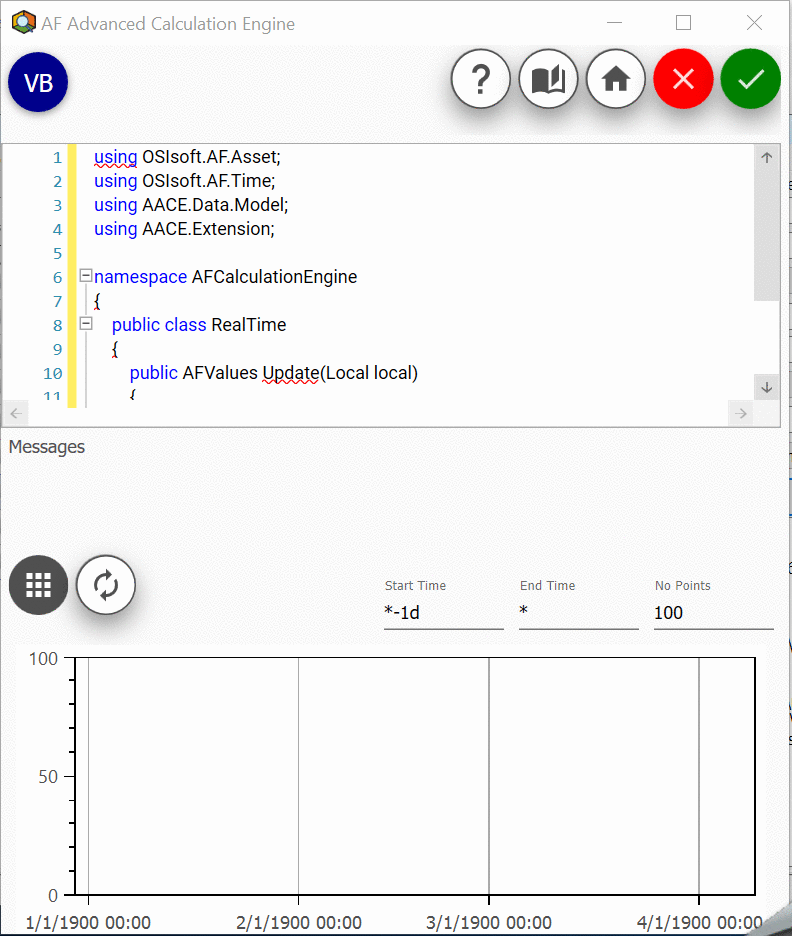
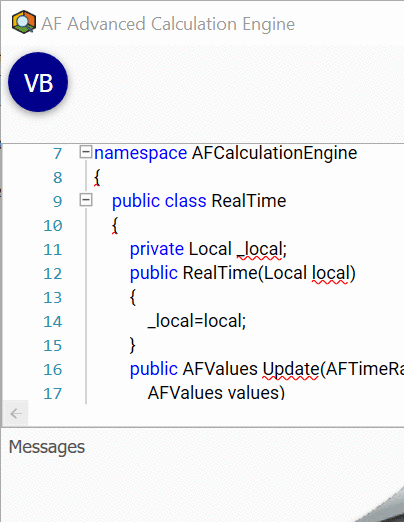

# Advanced-Calculation-Engine-for-AF

Advanced-Calculation-Engine-for-AF is a tool that allows developers to create and manage calculations using data from Osisoft's PI System within PI Asset Framework.

## Getting Started

These instructions will get you a copy of the project up and running on your local machine. See deployment for notes on how to deploy Advanced-Calculation-Engine-for-AF within PI System Explorer.

### Prerequisites

PI AF Client 2015 R2. Installation instructions can be found [here](https://livelibrary.osisoft.com).

### Installing

Follow the step-by-step procedure below to install the software.

1. Download the AACE.Main.dll file.

2. Install through the command prompt using the following command.  
"%PIHOME%\AF\regplugin.exe" "Insert Install Path Here\AACE.Main.dll"

## Deployment

The AF Advanced Calculation Engine may be accessed via the PI System Explorer by configuring the attribute of an element to be referenced as a AF Advanced Calculation Engine data reference. Click on settings to access the user-friendly graphical user interface.

## Graphical User Interface

INSERT GRAPHICAL USER INTERFACE LAYOUT PITCTURE HERE - INSERT GRAPHICAL USER INTERFACE LAYOUT PITCTURE HERE

Describe what each button/feature on the GUI does, etc.

* **Insert Programming Language Button** allows the user to specify what programming language is going to be used. Currently available languages include C# and VB.NET.

* **Code Editor** provides text editing features such as syntax highlighting, code outlining, line numbers, IntelliPrompt UI, and many more.  

* **Messages** displays error messages notifying user of errors found in the code editor and execution time if execution is successful.  
* **Choose Plot or Data Grid Button**  allows the user to view a plot of returned values against time or a data grid showing name, time stamp, value, unit of measure (UOM), and calculation error notification (IsGood).  

* **Recalculate Button**  takes the code written in the code editor and compiles it at runtime.  

* **Chart/Grid View** displays a plot or data grid depending on the option chosen on the "Choose Plot or Data Grid" button.  

* **Ok; Checkin Button** takes the code written in the code editor and checks in the language, change date, publisher, and code.  

* **Cancel Button**  cancels any operations and closes the graphical user interface.  

* **About Button**  redirects the user to the software's about section.

* **Sample Library Button** redirects the user to a source where they can find samples of code that perform specific functions.  

* **Help Button** redirects the user to help source.  

* **Number of Points Field**  allows the user to specify the amount of points to display.  

* **End Time Field**  allows the user to specify the rightmost boundary of the time frame being examined.  

* **Start Time Field**  allows the user to specify the leftmost boundary of the time frame being examined.  

## Built With

* Windows 7
* .NET Framework 4.5.2
* C#

## Versioning

We use [Bitbucket](https://bitbucket.org/) for versioning.

## Authors

[TQSIntegration](https://www.tqsintegration.com/)

## License

This project is licensed under the MIT License - see the [LICENSE.md](LICENSE.md) file for details

- [Heading](#heading)
  * [Sub-heading](#sub-heading)
    + [Sub-sub-heading](#sub-sub-heading)
- [Heading](#heading-1)
  * [Sub-heading](#sub-heading-1)
    + [Sub-sub-heading](#sub-sub-heading-1)
- [Heading](#heading-2)
  * [Sub-heading](#sub-heading-2)
    + [Sub-sub-heading](#sub-sub-heading-2)
- [Heading](#heading-3)
  * [Sub-heading](#sub-heading-3)
    + [Sub-sub-heading](#sub-sub-heading-3)
- [Heading](#heading-4)
  * [Sub-heading](#sub-heading-4)
    + [Sub-sub-heading](#sub-sub-heading-4)
- [Heading](#heading-5)
  * [Sub-heading](#sub-heading-5)
    + [Sub-sub-heading](#sub-sub-heading-5)
- [Heading](#heading-6)
  * [Sub-heading](#sub-heading-6)
    + [Sub-sub-heading](#sub-sub-heading-6)

# Heading levels

> This is a fixture to test heading levels

<!-- toc -->

## Heading

This is an h1 heading

### Sub-heading

This is an h2 heading

#### Sub-sub-heading

This is an h3 heading

## Heading

This is an h1 heading

### Sub-heading

This is an h2 heading

#### Sub-sub-heading

This is an h3 heading

## Heading

This is an h1 heading

### Sub-heading

This is an h2 heading

#### Sub-sub-heading

This is an h3 heading

## Heading

This is an h1 heading

### Sub-heading

This is an h2 heading

#### Sub-sub-heading

This is an h3 heading

## Heading

This is an h1 heading

### Sub-heading

This is an h2 heading

#### Sub-sub-heading

This is an h3 heading

## Heading

This is an h1 heading

### Sub-heading

This is an h2 heading

#### Sub-sub-heading

This is an h3 heading

## Heading

This is an h1 heading

### Sub-heading

This is an h2 heading

#### Sub-sub-heading

This is an h3 heading
