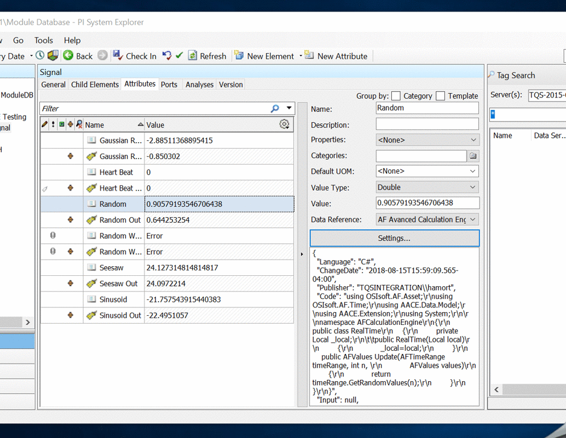
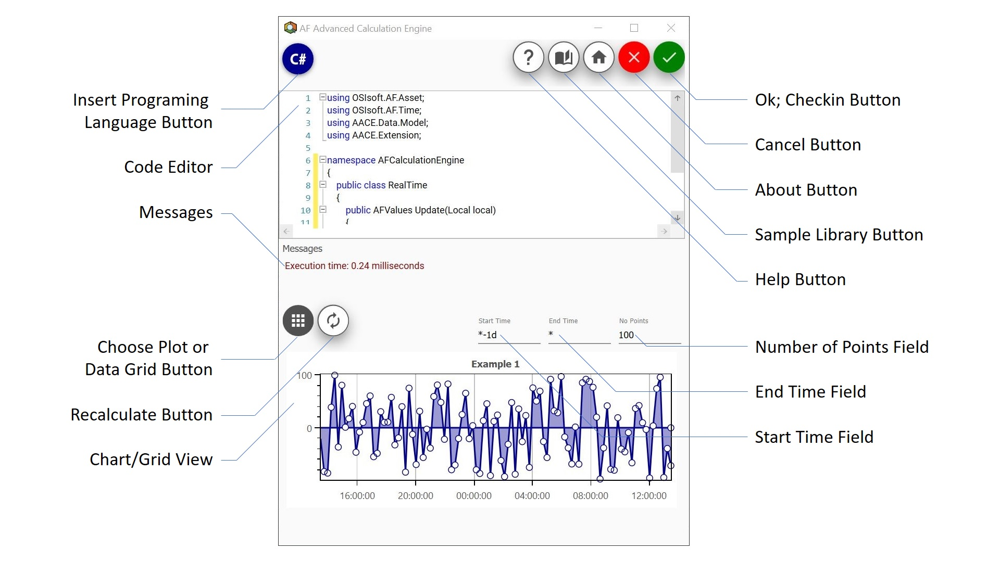
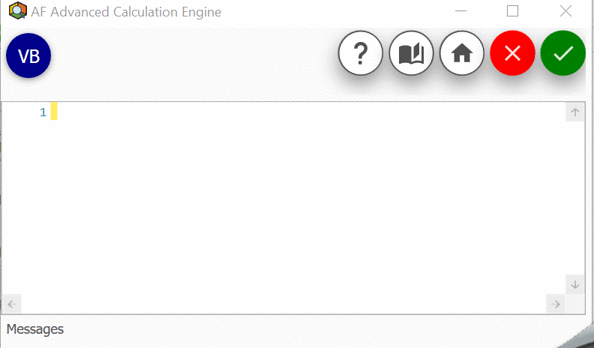
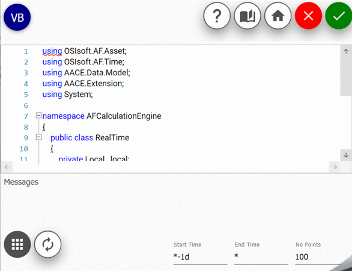

# Advanced-Analytics-Engine-for-AF

Advanced-Analytics-Engine-for-AF is a tool that allows developers to create and manage calculations using data from Osisoft's PI System within PI Asset Framework.

  

This Github repository is to host samples, documentation and to allow TQS Integration to publish ongoing code samples that users might wish to test or deploy. The Advanced Analytics Engine for AF is a licensed product, and for pricing details on purchasing the software, please contact us at [TQS Integration](mailto:sales@tqsintegration.com), or visit our [website](www.tqsintegration.com) for further details. 

**Table of Contents**
* [Code Documentation](https://github.com/tqsintegration/Advanced-Calculation-Engine-for-AF/blob/master/Code%20Documentation.md)
* [PI ACE Migration](https://github.com/tqsintegration/Advanced-Calculation-Engine-for-AF/blob/master/PI%20ACE%20Migration.md)
* [Sample Library](https://github.com/tqsintegration/Advanced-Calculation-Engine-for-AF/blob/master/Sample%20Library.md)
* [Real Time Operators](https://github.com/tqsintegration/Advanced-Calculation-Engine-for-AF/blob/master/Real%20Time%20Operators.md)

## Getting Started

These instructions will get you a copy of the project up and running on your local machine. See deployment for notes on how to deploy Advanced-Analytics-Engine-for-AF within PI System Explorer.

### Prerequisites

* Minimum PI AF Client 2015 R2. Installation instructions can be found [here](https://livelibrary.osisoft.com).
* .NET Framework 4.5.2  
__Note:__ The LegacyBatch class requires an Installation of the latest PI-SDK library.

### Installing

Follow the step-by-step procedure below to install the software.

1. Download the AACE.Main.dll file.

2. Install through the command prompt using the following command.  
"%PIHOME%\AF\regplugin.exe" "Insert Install Path Here\AACE.Main.dll"

## Deployment

The AF Advanced Analytics Engine may be accessed via the PI System Explorer by configuring the attribute of an element to be referenced as a AF Advanced Analytics Engine data reference. Click on settings to access the user-friendly graphical user interface.

## Graphical User Interface

  

* **Insert Programming Language Button** allows the user to specify what programming language is going to be used. 

  

* **Code Editor** provides text editing features such as syntax highlighting, code outlining, line numbers, IntelliPrompt UI, and many more.  

  

* **Messages** displays error messages notifying user of errors found in the code editor and execution time if execution is successful. 

  

* **Choose Plot or Data Grid Button**  allows the user to view a plot of returned values against time or a data grid showing name, time stamp, value, unit of measure (UOM), and calculation error notification (IsGood). 

  

* **Recalculate Button**  takes the code written in the code editor and compiles it at runtime.  

* **Chart/Grid View** displays a plot or data grid depending on the option chosen on the "Choose Plot or Data Grid" button.  

* **Ok; Checkin Button** takes the code written in the code editor and checks in the language, change date, publisher, and code.  

* **Cancel Button**  cancels any operations and closes the graphical user interface.  

* **About Button**  redirects the user to the software's about section.

* **Sample Library Button** redirects the user to a source where they can find samples of code that perform specific functions.  

* **Help Button** redirects the user to help source.  

* **Number of Points Field**  allows the user to specify the amount of points to display.  

* **End Time Field**  allows the user to specify the rightmost boundary of the time frame being examined.  

* **Start Time Field**  allows the user to specify the leftmost boundary of the time frame being examined.  

## Contributing
Please make sure that you read our general [Contribution Guidelines](CODE_OF_CONDUCT.md) and agree with them. These guidelines apply to all TQS Integration projects on GitHub.

We welcome everyone to share enhancement requests, issues and contributions. While all contributions will be considered by our team, we recommend everyone perform their own reviews on contributions prior to adopting them. We do not manage, test or verify functionality of contributions, and users adopt them at their own risk. 

## Versioning

TQS Integration supports and licenses software developed for regulated industries, and as such, all software development is performed under our strict software development lifecycle process. For details, please visit our website [TQSIntegration](https://www.tqsintegration.com/).

## Authors
TQS Integration (https://www.tqsintegration.com/)   

## License
Copyright 2020 TQS Integration, LLC.

Licensed under the Apache License, Version 2.0 (the "License"); you may not use this file except in compliance with the License. You may obtain a copy of the License at [LICENSE.md](LICENSE.md).

Unless required by applicable law or agreed to in writing, software distributed under the License is distributed on an "AS IS" BASIS, WITHOUT WARRANTIES OR CONDITIONS OF ANY KIND, either express or implied. See the License for the specific language governing permissions and limitations under the License.
